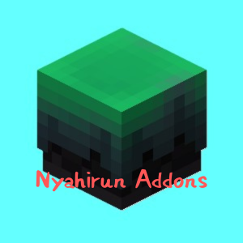

<h1 align="center">Nyahirun Addons</h1>

  Nyahirun Addons is a Minecraft Mod for Hypixel Skyblock Dungeon.

<h3 align="center">This is Stella Addon</h3>

  

---

## Features
### NA1
- General
  - More Info and Highlight Party Finder
  - Use Pet Highlight
  - Efficient Dungeon Breaker

- AutoRefill
  - Ender Pearl
  - SuperboomTNT
  - Spirit Leap
  - Inflatable Jerry
  - Decoy

- RenderHighlight
  - Secret Drop Item
  - Wither HitBox
  - Mimic Chest

- Disable Use
  - Second Soul Sand
  - Place Tuba
  - SBMenu

### NA2
- ChatHiders
- Notifications

---

## Require Mod
Stella: [Github Link](https://github.com/Eclipse-5214/stella) / [Modrinth Link](https://modrinth.com/mod/stella)

Require Version: Beta 1.0.4

---

## Installation
1. Install Fabric 1.21.10
2. Download this mod and Stella
3. Place the mod jar files into your mods folder
4. Use /stella to configure features
5. Enjoy Dungeon!

***
***

<h2 align="center">Credits</h2>

***
- Stella
- [SBD](https://github.com/Evankhell0/sbd) inspired Party FInder

- [HypixelAPI](https://developer.hypixel.net/) using Party Finder
- [CloudFlare](https://www.cloudflare.com/) cached API data

